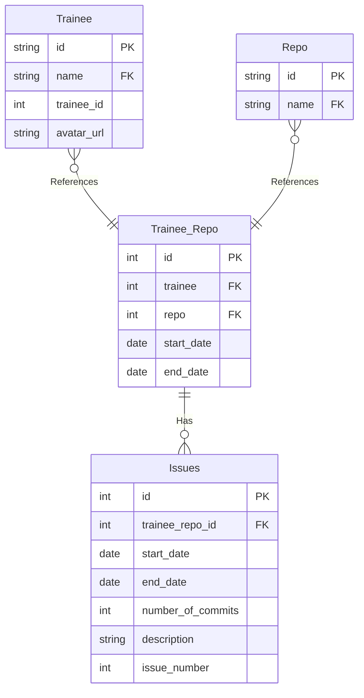

# ERD Do-I-Code

```mermaid
erDiagram
    Trainee {
        string id    PK
        string name  FK
        int    trainee_id
        string avatar_url 
    }
    Repo {
        string id    PK
        string name  FK
    }
    Trainee_Repo {
        int    id PK
        int    trainee FK
        int    repo FK
        date   start_date
        date   end_date
    }
    Trainee }o--|| Trainee_Repo : References 
    Repo }o--|| Trainee_Repo : References 
    Issues {
        int    id              PK
        int    trainee_repo_id FK
        date   start_date
        date   end_date
        int    number_of_commits  
        string description
        int    issue_number  
    }    
    Trainee_Repo ||--o{ Issues : Has
```