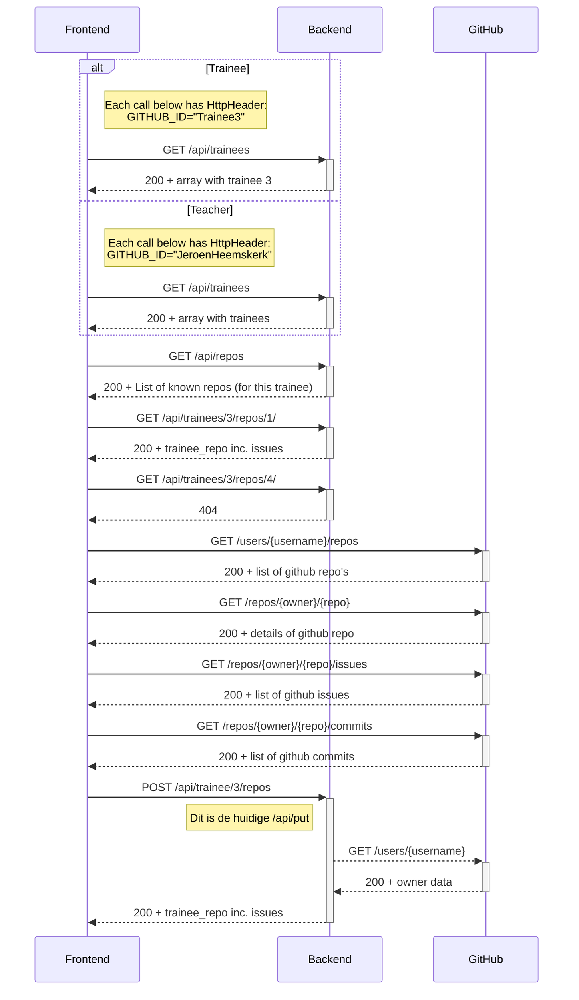
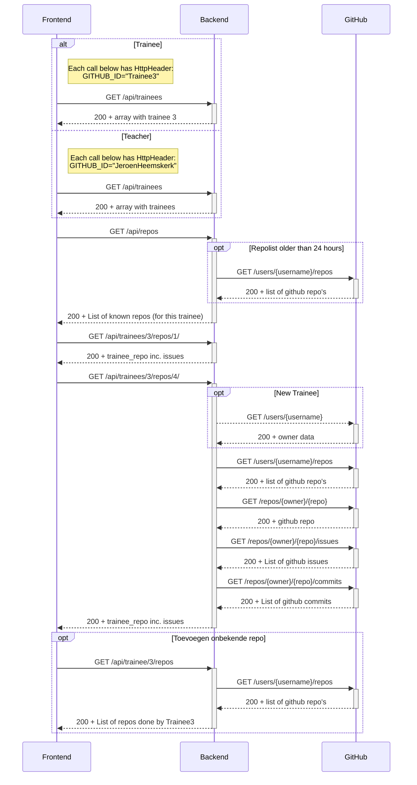

Sequence diagram voor ophalen van issues (versie 1.0)

```mermaid
sequenceDiagram
    alt Trainee
    note right of Frontend: Each call below has HttpHeader:<br/>GITHUB_ID="Trainee3"
    Frontend->>+Backend: GET /api/trainees
    Backend-->>-Frontend: 200 + array with trainee 3
    else Teacher
    note right of Frontend: Each call below has HttpHeader:<br/>GITHUB_ID="JeroenHeemskerk"
    Frontend->>+Backend: GET /api/trainees
    Backend-->>-Frontend: 200 + array with trainees
    end
    Frontend->>+Backend: GET /api/repos
    Backend-->>-Frontend: 200 + List of known repos (for this trainee)
    Frontend->>+Backend: GET /api/trainees/3/repos/1/
    Backend-->>-Frontend: 200 + trainee_repo inc. issues
    Frontend->>+Backend: GET /api/trainees/3/repos/4/
    Backend-->>-Frontend: 404
    Frontend->>+GitHub: GET /users/{username}/repos
    GitHub-->>-Frontend: 200 + list of github repo's
    Frontend->>+GitHub: GET /repos/{owner}/{repo}
    GitHub-->>-Frontend: 200 + details of github repo
    Frontend->>+GitHub: GET /repos/{owner}/{repo}/issues
    GitHub-->>-Frontend: 200 + list of github issues
    Frontend->>+GitHub: GET /repos/{owner}/{repo}/commits
    GitHub-->>-Frontend: 200 + list of github commits
    Frontend->>+Backend: POST /api/trainee/3/repos
    note left of Backend: Dit is de huidige /api/put
    Backend-->>+GitHub: GET /users/{username}
    GitHub-->>-Backend: 200 + owner data
    Backend-->>-Frontend: 200 + trainee_repo inc. issues
```

Sequence diagram voor ophalen van issues (versie 2.0)

```mermaid
sequenceDiagram
    alt Trainee
    note right of Frontend: Each call below has HttpHeader:<br/>GITHUB_ID="Trainee3"
    Frontend->>+Backend: GET /api/trainees
    Backend-->>-Frontend: 200 + array with trainee 3
    else Teacher
    note right of Frontend: Each call below has HttpHeader:<br/>GITHUB_ID="JeroenHeemskerk"
    Frontend->>+Backend: GET /api/trainees
    Backend-->>-Frontend: 200 + array with trainees
    end
    Frontend->>+Backend: GET /api/repos
    opt Repolist older than 24 hours
    Backend->>+GitHub: GET /users/{username}/repos
    GitHub-->>-Backend: 200 + list of github repo's
    end
    Backend-->>-Frontend: 200 + List of known repos (for this trainee)
    Frontend->>+Backend: GET /api/trainees/3/repos/1/
    Backend-->>-Frontend: 200 + trainee_repo inc. issues
    Frontend->>+Backend: GET /api/trainees/3/repos/4/
    opt New Trainee
    Backend-->>+GitHub: GET /users/{username}
    GitHub-->>-Backend: 200 + owner data
    end
    Backend->>+GitHub: GET /users/{username}/repos
    GitHub-->>-Backend: 200 + list of github repo's
    Backend->>+GitHub: GET /repos/{owner}/{repo}
    GitHub-->>-Backend: 200 + github repo
    Backend->>+GitHub: GET /repos/{owner}/{repo}/issues
    GitHub-->>-Backend: 200 + List of github issues
    Backend->>+GitHub: GET /repos/{owner}/{repo}/commits
    GitHub-->>-Backend: 200 + List of github commits
    Backend-->>-Frontend: 200 + trainee_repo inc. issues
    opt Toevoegen onbekende repo
    Frontend->>+Backend: GET /api/trainee/3/repos
    Backend->>+GitHub: GET /users/{username}/repos
    GitHub-->>-Backend: 200 + list of github repo's
    Backend-->>-Frontend: 200 + List of repos done by Trainee3
    end
```
