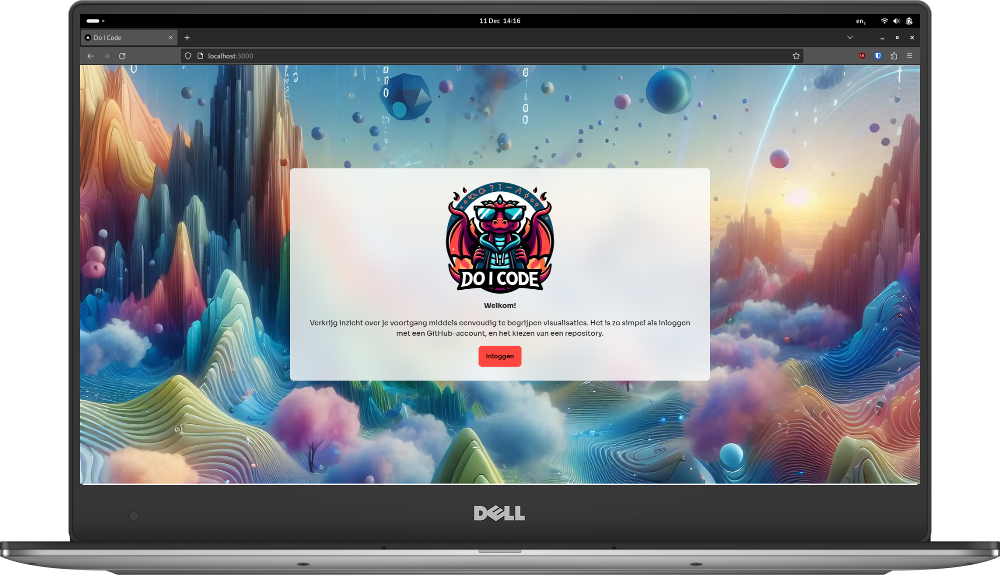
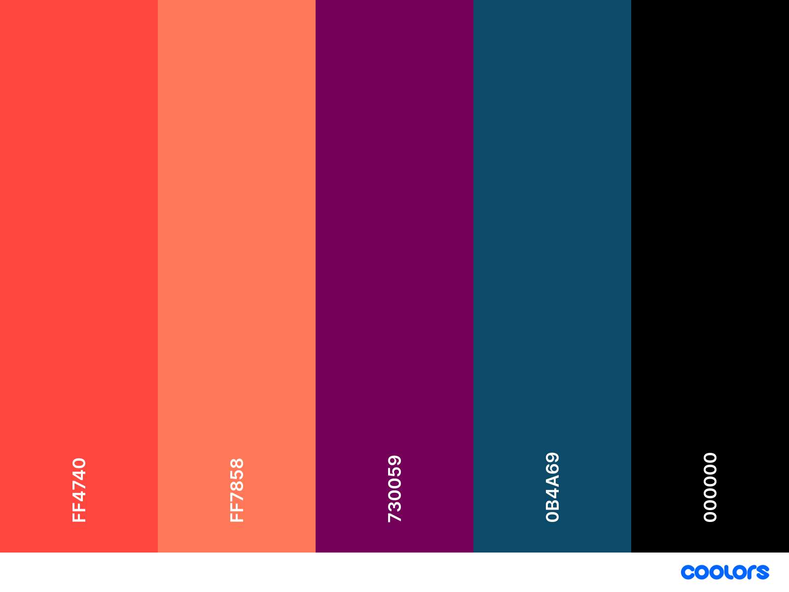

# Front-end
<br>
You can give [Do I Code](https://do-i-code.com) a try in your browser right now!

With Do I Code, you can achieve better insight into the progress you've made inside of GitHub repositories using easy-to-understand visualizations. To get started, simply login with a GitHub account and choose a repository.

This is the front-end component of the Do I Code application, which makes use of [Next.js](https://nextjs.org/learn). Currently, the only supported language in the user-interface is Dutch.

## Setup 

### Setup an OAuth with GitHub
This application requires you to register a GitHub OAuth application. [Create an OAuth application](https://docs.github.com/en/apps/oauth-apps/building-oauth-apps/creating-an-oauth-app) in your GitHub account or organization and set the following settings:
* `Application name`: `do-i-code - development`
* `Homepage URL`: `http://localhost:3000`
* `Authorization callback URL` to `http://localhost:3000/api/auth/callback/github`. 
* `Application logo`: upload the file `logo-crop.png` from the folder `.\frontend-next-js\public\`
If you plan to use the application outside of a local development environment, replace `http://localhost:3000` part accordingly. It can be useful to create separate OAuth applications for development and production, as GitHub only allows one authorization callback URL per app.

### Setup the Next JS application
To run the application locally, you will need to have [Node.js](https://e-learning.educom.nu/algemeen/nodejs) installed. You can initialize a Node.js application by running `npm install` in the `frontend-next-js` folder. 

### Create a `.env.local` file
In order to run the application, you need to create a `.env.local` file in the root of the project containing environment variables. The following environment variables will need to be configured appropriately.

```
GITHUB_CLIENT_ID='' # provided when creating an oauth app with github
GITHUB_CLIENT_SECRET='' # provided when creating an oauth app secret in the oauth app with github
NEXTAUTH_SECRET='' # run to generate: openssl rand -base64 32 
# or go to https://generate.plus/en/base64?utm_content=cmp-true and select length: 32 & url-safe
```

#### Configure backend endpoint
While this application can function on its own, it is possible to relay repository and issue information to a backend component. This means that every time the application fetches this data from GitHub, it will also send this data to a given endpoint. To enable this functionality, add the following environment variable to your `.env.local` file.

```
BACKEND_ENDPOINT='https://example.com/api/put'
```
for example if you run your backend locally on port 8000 add the following to your `.env.local` file
```
BACKEND_ENDPOINT='http://127.0.0.1:8000/api/put'
```

In case your backend endpoint is public, you might want to protect it from unauthorized usage. This can be achieved by providing a password string with every request for the backend to check against. The password can be specified in the `.env.local` file as follows.

```
BACKEND_PASSWORD='example'
```

for local testing use `z3Q#!A4ZCqsids` as password.

When these environment variables have been defined, JSON data will be sent to this endpoint using PUT requests. An example is provided below. We have assumed a password string is provided as well, which is optional.

```json
{
  "repository": {
    ...
  },
  "issues": [
    {
      ...
    },
    ...
  ],
  "commits": [
    {
      ...
    },
    ...
  ],
  "password": "example"
}
```

* The contents of `repository` is equal to the result of the [`/repos/{owner}/{repo}` GitHub REST API endpoint](https://docs.github.com/en/rest/repos/repos?apiVersion=2022-11-28#get-a-repository),
* The contents of `issues` is equal to the result of the [`/repos/{owner}/{repo}/issues` GitHub REST API endpoint](https://docs.github.com/en/rest/issues/issues?apiVersion=2022-11-28#list-repository-issues)
* The contents of `commits` is equal to the result of the [`/repos/{owner}/{repo}/commits` GitHub REST API endpoint](https://docs.github.com/en/rest/commits/commits?apiVersion=2022-11-28#list-commits).

## Run the application 
To start the application (with development and debugging tools), run `npm run dev` in the `frontend-next-js` folder.
>[NOTE] 
> To store the data in the backend, make sure the backend is also running!

There is a hidden page called http://localhost:8000/powerbi that brings you to the powerBI dashboard


## Design Guidelines
<br>
<br>
A few design guidelines have been divised to improve the consistency or the interface of the application. Please adhere to these guidelines when developing the interface and update them when necessary.

### Font
The application makes use of the "Sora" font, designed by Jonathan Barnbrook and Julián Moncada. More information can be found on [Google Fonts](https://fonts.google.com/specimen/Sora).

### Color Palette
[](./public/palette.pdf)

## AI Disclosure
The logo and the various backgrounds that can be found in this project were created with the help of AI, and serve mostly as a placeholder. Please refrain from using this media in a commercial context. The particular files are as follows.

- `/public/logo.png`
- `/public/logo-alt.png`
- `/public/logo-crop.png`
- `/public/background-1.png`
- `/public/background-2.png`
- `/public/background-3.png`
- `/public/background-4.png`
- `/public/background-5.png`
- `/public/mockup-desktop.png` (contains `/public/logo.png` and `/public/background-1`)
- `/public/mockup-mobile.png` (contains `/public/logo.png` and `/public/background-1`)


## Issues
When reporting issues, please be as descriptive as possible. For immediate support create an issue in this repository

:copyright: Created by [Jelle Zwiers](https://github.com/jelle619/doicode?tab=readme-ov-file)
